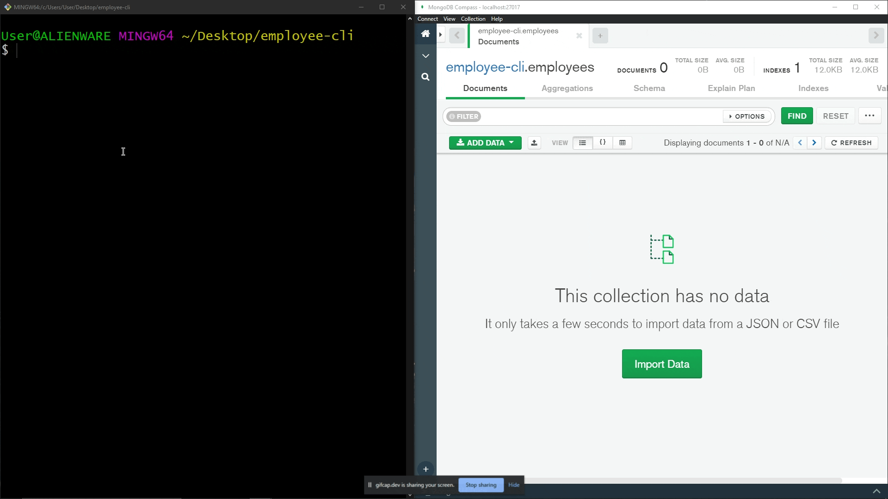
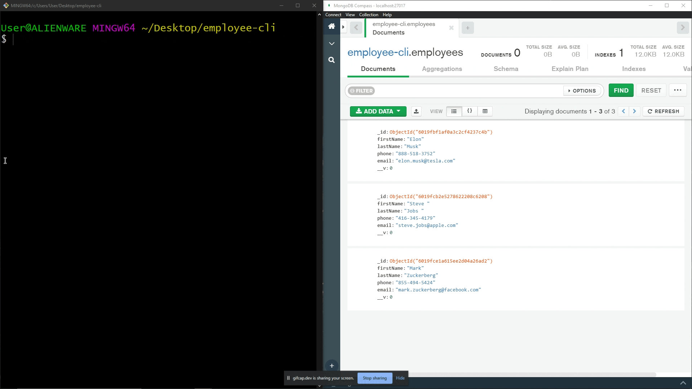
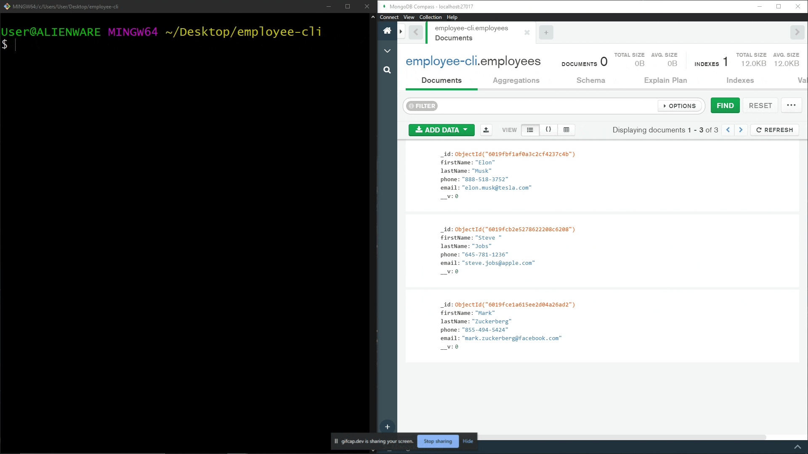
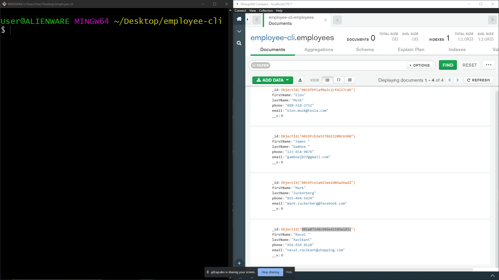

# employee-database-CLI
This is a command line interface for storing employees into a local database using Mongodb

## **Add an employee**

## **Finding by employee name**

## **Finding and employee and updating by Id**

## **Lisiting all employees and removing by Id**

